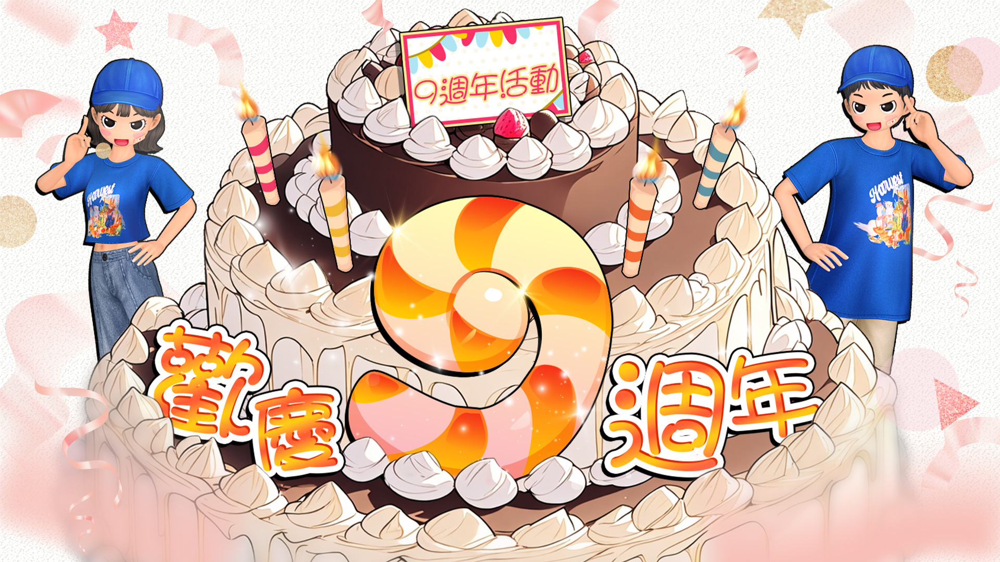

<html lang="zh-Hant">
<head>
    <meta charset="UTF-8">
    <meta name="viewport" content="width=device-width, initial-scale=1.0">
    <title>找碴小遊戲</title>
    
    <meta charset="UTF-8">
    <meta name="viewport" content="width=device-width, initial-scale=1.0">

    <h2>🎯 找看看有幾隻哈特？</h2>
    
請先填寫基本資料開始遊戲

    <input type="text" id="username" placeholder="您的勁舞團(快樂玩)帳號" required>
    <input type="tel" id="phone" placeholder="您的勁舞團暱稱" required>

    

        
        
🔍 請問圖中總共有幾隻哈特貓？

        <select id="catCount" style="width: 100%; padding: 12px; font-size: 16px; border-radius: 8px; border: 1px solid #ddd;">
            <option value="">-- 請選擇數量 --</option>
            <option value="10">10 隻</option>
            <option value="12">12 隻</option>
            <option value="16">16 隻</option>
            <option value="18">18 隻</option>
            <option value="20">20 隻</option>
        </select>
    

    <button onclick="submitGame()" style="margin-top: 20px;">提交結果</button>

<script>
    const canvas = document.getElementById('gameCanvas');
    const ctx = canvas.getContext('2d');
    const img = new Image();

    // 預設一張範例圖，你可以之後換成自己的 game.jpg
    img.src = 'game.jpg';
    
    img.onload = () => {
        canvas.width = img.width;
        canvas.height = img.height;
        ctx.drawImage(img, 0, 0);
    };

    let painting = false;
    function getPos(e) {
        const rect = canvas.getBoundingClientRect();
        const clientX = e.touches ? e.touches[0].clientX : e.clientX;
        const clientY = e.touches ? e.touches[0].clientY : e.clientY;
        return {
            x: (clientX - rect.left) * (canvas.width / rect.width),
            y: (clientY - rect.top) * (canvas.height / rect.height)
        };
    }

    function startPosition(e) { painting = true; draw(e); }
    function finishedPosition() { painting = false; ctx.beginPath(); }
    
    function draw(e) {
        if (!painting) return;
        e.preventDefault();
        const pos = getPos(e);
        ctx.lineWidth = 6;
        ctx.lineCap = 'round';
        ctx.strokeStyle = 'red';

        ctx.lineTo(pos.x, pos.y);
        ctx.stroke();
        ctx.beginPath();
        ctx.moveTo(pos.x, pos.y);
    }

    canvas.addEventListener('mousedown', startPosition);
    canvas.addEventListener('mouseup', finishedPosition);
    canvas.addEventListener('mousemove', draw);
    canvas.addEventListener('touchstart', startPosition, {passive: false});
    canvas.addEventListener('touchend', finishedPosition);
    canvas.addEventListener('touchmove', draw, {passive: false});

function submitGame() {
        const name = document.getElementById('username').value;
        const phone = document.getElementById('phone').value;
        const canvas = document.getElementById('gameCanvas');
        
        if(!name || !phone) { alert("請完整填寫資料唷！"); return; }
        
        // 取得圖片數據 (Base64 格式)
        const finalImage = canvas.toDataURL("image/jpeg, 0.5");
        
        // 這是你剛剛產生的 GAS 網址
        const scriptURL = 'https://script.google.com/macros/s/AKfycbwUFAeQJo8i8eBr8Jgq1d-UypxOZhqX9NWcXKL1iuQZINWpGB-6Tb1KJLRCuvZEUKd3/exec';

        const data = {
            name: name,
            phone: phone,
            image: finalImage
        };

        // 發送資料到 Google Sheet
        fetch(scriptURL, {
            method: 'POST',
            mode: 'no-cors', // 避免跨網域問題
            cache: 'no-cache',
            headers: { 'Content-Type': 'application/json' },
            body: JSON.stringify(data)
        })
        .then(() => {
            alert("提交成功！\n感謝 " + name + " 參與活動，資料已存入試算表。");
        })
        .catch(error => {
            console.error('Error!', error.message);
            alert("提交失敗，請檢查網路連線。");
        });
    }
